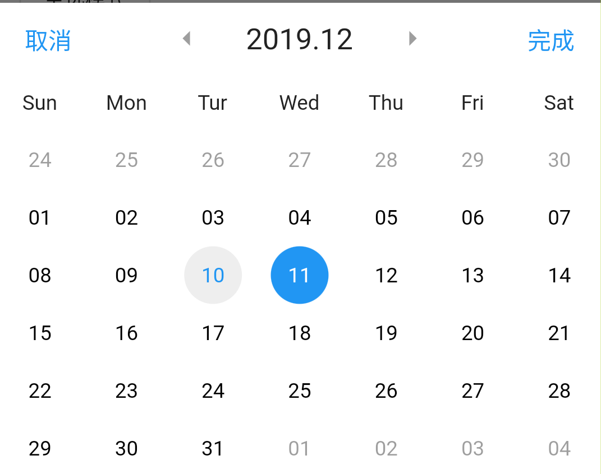
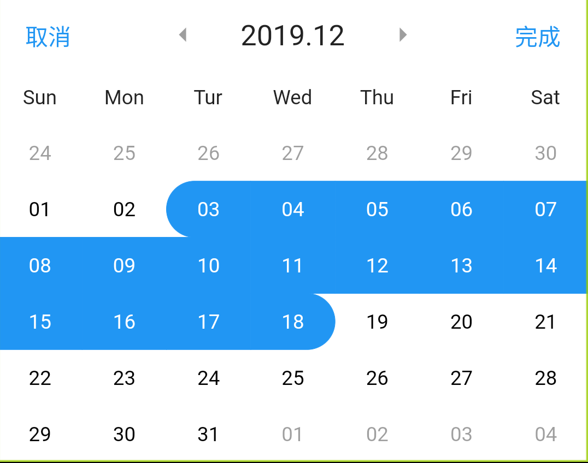

# nccalendar

> Flutter 日历选择插件

### 效果：

* 单选模式

  

* 多选模式

  

### 使用：

```dart
NCCalendar(
            //选择模式，是否多选
            isDateRangeMode: false,
            //单选模式的初始日期
            selectedDate: dt,
            //多选模式的初始开始日期
            startDate: st,
            //多选模式的初始结束日期
            endDate: et,
            //单选模式的回调
            onDateSelected: (dt) {
              Navigator.of(ctx).pop();
              setState(() {
                _singleDT = DateFormat('yyyy.MM.dd').format(dt);
              });
            },
            //多选模式的回调
            onDateRangeSelected: (st, et) {
              Navigator.of(ctx).pop();
              setState(() {
                _multiDT =
                    '${DateFormat('yyyy.MM.dd').format(st)} - ${DateFormat('yyyy.MM.dd').format(et)}';
              });
            },
          );
        })
```


# License

```
Licensed under the MIT License

Copyright (c) 2019 YoungChan

Permission is hereby granted, free of charge, to any person obtaining a copy of this software and associated documentation files (the "Software"), to deal in the Software without restriction, including without limitation the rights to use, copy, modify, merge, publish, distribute, sublicense, and/or sell copies of the Software, and to permit persons to whom the Software is furnished to do so, subject to the following conditions:

The above copyright notice and this permission notice shall be included in all copies or substantial portions of the Software.

THE SOFTWARE IS PROVIDED "AS IS", WITHOUT WARRANTY OF ANY KIND, EXPRESS OR IMPLIED, INCLUDING BUT NOT LIMITED TO THE WARRANTIES OF MERCHANTABILITY, FITNESS FOR A PARTICULAR PURPOSE AND NONINFRINGEMENT. IN NO EVENT SHALL THE AUTHORS OR COPYRIGHT HOLDERS BE LIABLE FOR ANY CLAIM, DAMAGES OR OTHER LIABILITY, WHETHER IN AN ACTION OF CONTRACT, TORT OR OTHERWISE, ARISING FROM, OUT OF OR IN CONNECTION WITH THE SOFTWARE OR THE USE OR OTHER DEALINGS IN THE SOFTWARE.

```